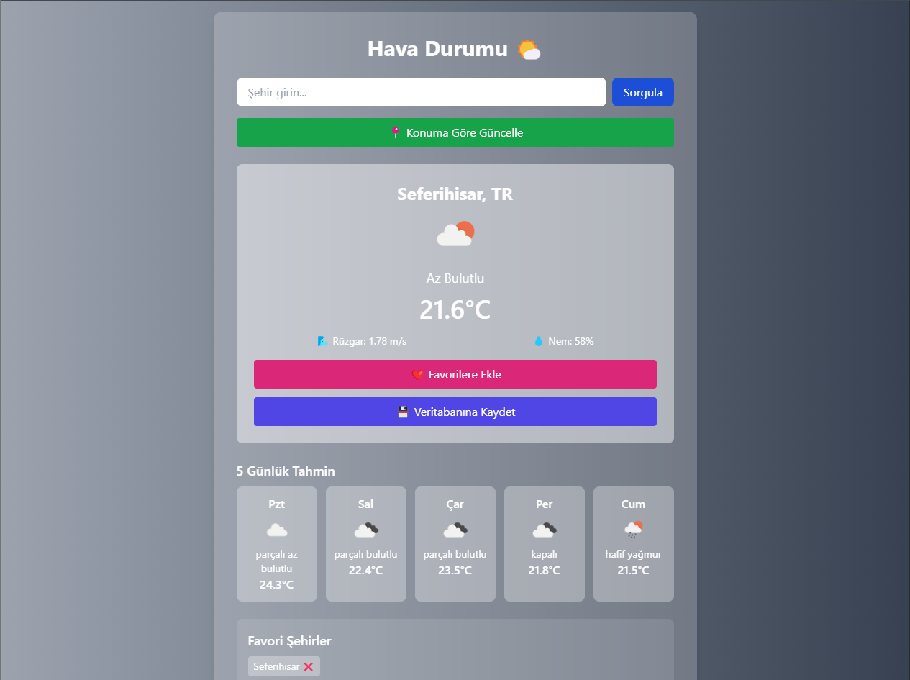
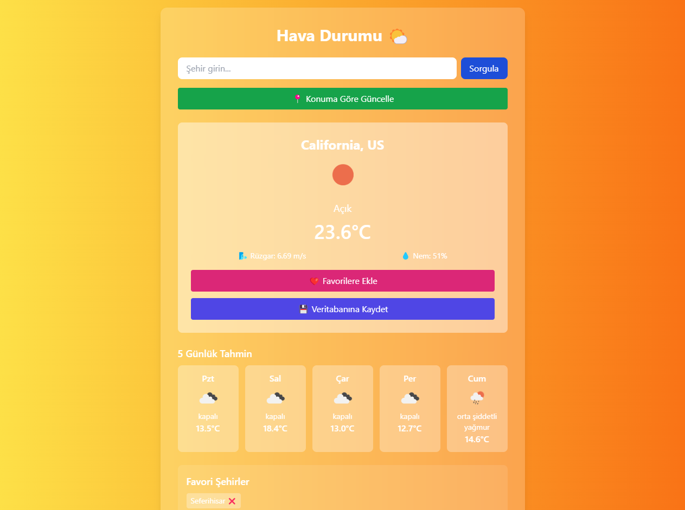

# ☀️ Weather Forecast App

A full-stack weather forecast application built with **React**, **Node.js**, and **MongoDB**.  
It fetches real-time weather data using the **OpenWeatherMap API** and allows users to view 5-day forecasts, save their favorite cities, and store data in a database.

🔗 **Live Demo:** [https://your-vercel-app.vercel.app](https://your-vercel-app.vercel.app)

---

## 🛠️ Built With

- 🔵 **Frontend:** React, Tailwind CSS
- 🟢 **Backend:** Node.js, Express
- 🍃 **Database:** MongoDB Atlas
- ☁️ **Hosting:** Vercel (frontend), Render (backend)
- 🌍 **API:** OpenWeatherMap

---

## ✨ Features

- 📍 Detects current location & displays weather
- 🔍 Search weather by city name
- ❤️ Save & remove favorite cities
- 🕔 5-day forecast preview
- 💾 Save data to MongoDB database
- 🚫 Prevents duplicate city entries
- 🎨 Responsive design with Tailwind

---

## 📸 Screenshots

> You can place screenshots in the `public/` or `assets/` folder and reference them like this:


*Home screen showing weather data with background gradient*


*5-day forecast layout with responsive design*

---

## ⚙️ Getting Started

### 1. Clone the repo

```bash
git clone https://github.com/your-username/weather-app.git
cd weather-app
```

### 2. Install dependencies

```bash
npm install
cd backend && npm install
```

### 3. Set up environment variables

Create two files:

#### For Frontend (`.env.local`):

```
REACT_APP_API_KEY=your_openweathermap_api_key
REACT_APP_BACKEND_URL=https://your-backend.onrender.com
```

#### For Backend (`.env`):

```
MONGO_URI=your_mongodb_connection_string
```

---

### 4. Run the app locally

```bash
# frontend
npm start

# backend (in a second terminal)
cd backend
node server.js
```

---

## 📡 API Usage

- `GET /api/cities` → Get all saved cities  
- `POST /api/cities` → Save new city weather data to DB (duplicate cities will be blocked)

---

## 🤝 Contributing

Pull requests are welcome. Feel free to open issues or suggest improvements.

---

## 📄 License
MIT License © 2025 Hüseyin Selen

